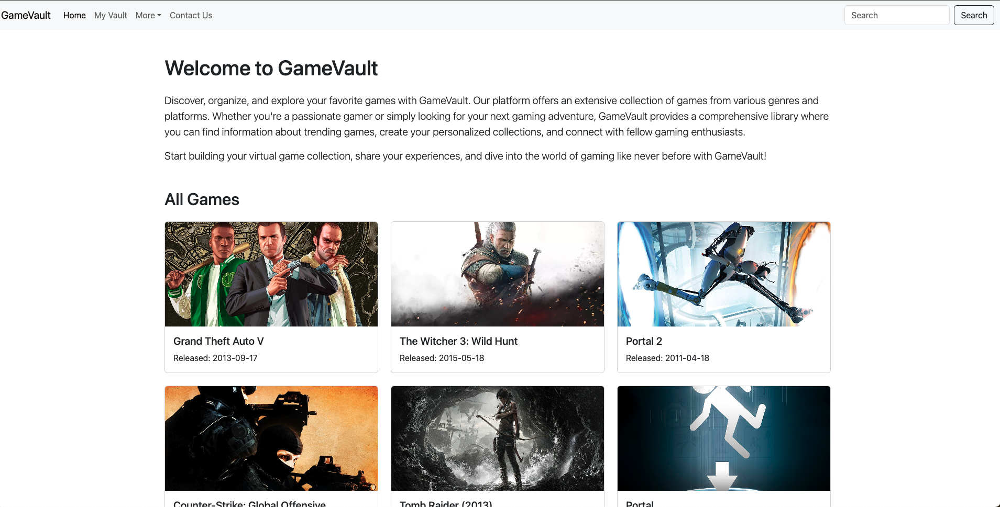

# Game Library Frontend

This is the frontend part of the Game Library project. It's built using [React](https://reactjs.org/) to interact with the Game Library API, allowing users to manage their game collections.


## Table of Contents

- [Installation](#installation)
- [Usage](#usage)
- [Folder Structure](#folder-structure)
- [Features](#features)
- [Dependencies](#dependencies)
- [Contributing](#contributing)
- [License](#license)

## Installation

To set up this frontend application locally, follow these steps:

1. **Clone the repository:**

    ```
    git clone https://github.com/your-username/game-library-frontend.git
    cd game-library-frontend
    ```

2. **Install dependencies:**

    ```
    npm install
    ```

3. **Start the development server:**

    ```
    npm start
    ```

    This will run the app in development mode. Open [http://localhost:3000](http://localhost:3000) to view it in the browser.

## Usage

This frontend application interacts with the Game Library API to perform various actions related to managing game collections. Ensure the API is running and accessible for the frontend to connect and fetch data.

## Folder Structure

The structure of the frontend project is organized as follows:


- `public/`: Contains public assets and the HTML file.
- `src/`: Holds the main source code of the application.
- `assets/`: Contains individual pages/views of the application.
- `components/`: Contains reusable React components.
- `App.js` and `main.jsx`: Entry points and main components.

## Features

- **View Games:** Browse a list of available games.
- **Add Games to Collection:** Add games to your personal collection.
- **Remove Games from Collection:** Remove games from your collection.
- **Update Game Details:** Modify game details within your collection.

## Dependencies

This project uses various dependencies, including but not limited to:

- [React](https://reactjs.org/): JavaScript library for building user interfaces.
- [React Router](https://reactrouter.com/): For routing within the application.
- [Axios](https://axios-http.com/): For making HTTP requests to the backend API.

Check the `package.json` file for a complete list of dependencies.

## Contributing

Contributions are welcome! If you want to contribute to this project, please follow the typical GitHub flow:

1. Fork the repository.
2. Create a new branch (`git checkout -b feature/your-feature`).
3. Make your changes.
4. Commit your changes (`git commit -am 'Add new feature'`).
5. Push to the branch (`git push origin feature/your-feature`).
6. Create a pull request.

